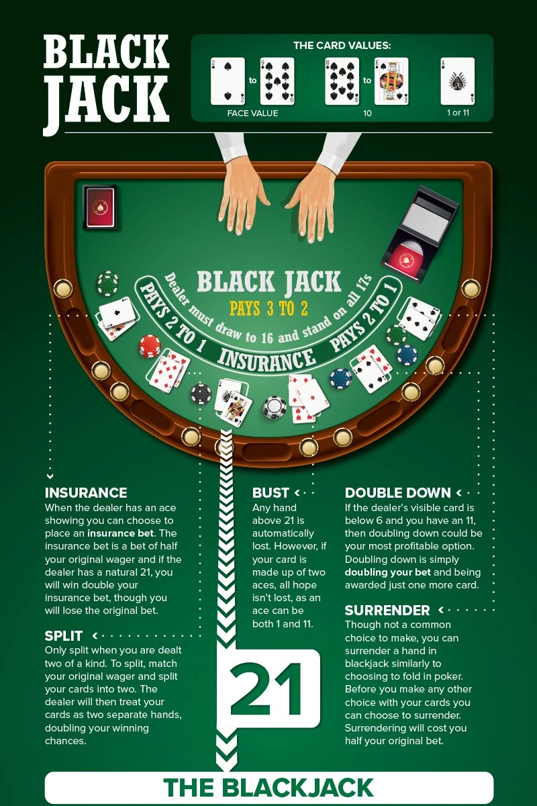
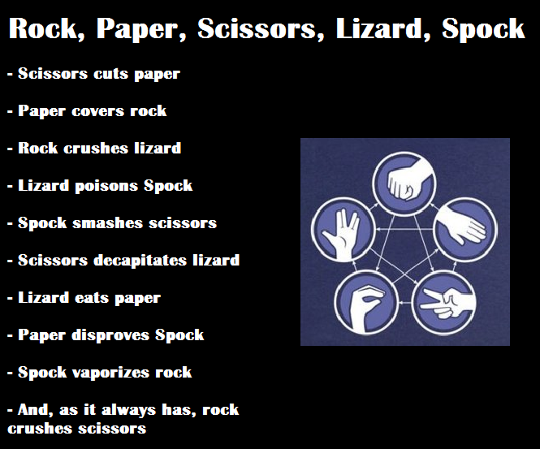

<h5>Time log: https://docs.google.com/spreadsheets/d/1lUsOUC2fbRDljCjvxWwighowklgWpwoVV_gzfDf-2TM/edit?usp=sharing
<h5>Additional requirements Document: https://docs.google.com/document/d/1aOwuMlhKVfmguq9ks0G5TxOorpi90ihLn462vxu7_vE/edit?usp=sharing

Requirement Engineering Artifact

Estimation of Person-Hours (within time log)

Accounted Person-Hours (within time log)

Agile Story Points (Luca)

Design Paradigm (Tram-Anh)

Software Architecture (Jacob)

UML Modeling Diagram (Bikash)

Project Design Pattern (Julia)

<h1> Our Project: Game Suite </h2>

- We are developing a game suite, stocked with 5 fun and exciting games to play:

<ol>
    <li>BlackJack</li>
    <li>Connect 4</li>
    <li>Tic-Tac-Toe</li>
    <li>Wordle</li>
    <li>Rock Paper Scissors Lizard Spock</li>
</ol>

<h2>BlackJack</h2>
    
Blackjack is a casino banking game that uses a 52 card deck with the objective of the game for the player or dealer to be dealt a hand with a value of no more than 21. Highest hand wins the round. Rules on how to play are below:

<h2>Connect 4
    
Two player game where each player has a set of colored tokens that they will take turns placing on a 6 by 7 playing board. Tokens are placed one by one in any available column and will drop down to the lowest available row. Play continues until a player gets four of their tokens in a row or a stalemate occurs. Four in a row vertical, horizontal, or diagonal are all valid ways to win.

<h2>Tic-Tac-Toe

<h2>Wordle

<h2>Rock Paper Scissors Lizard Spock
    
A spin on the classic "rock paper scissors", "Rock Paper Scissors Lizard Spock" is a more complex twist on the game adapted from the TV show "The Big Bang Theory". The Rules for what wins against what is nicely illustrated with the following image:

### Story Point Estimation

| 1 | 2 | 3 | 5 | 8 | 13 | 
| :-- | :-- | :-- | :-- | :-- | :-- | 
|Importing Project|Creating minigame classes ||RPSLS prototype|Connect 4 prototype|UML Diagram for Project 3|
|Dividing tasks|Barebones code for minigames||Tic-Tac-Toe prototype|Wordle prototype|Design Paradigm|
|Determining projected hours|Linking minigames to menu screen||BlackJack prototype|Software Architecture|Project Design Pattern|

#### Reasoning for estimation:
- We set each story point to have a time value of 20 minutes
- Since project 3 is just prototyping, we knew that the overall hours necessary to complete would be significantly lower, and that the heavy lifting would come into play during Project 4, where we will be fully implementing and polishing our games
- Overall, the documentation for Project 3 actually should take longer than the code, since we want to be very specific on the specifications for our finished Project before development goes into full swing (i.e. when Project 4 begins)
